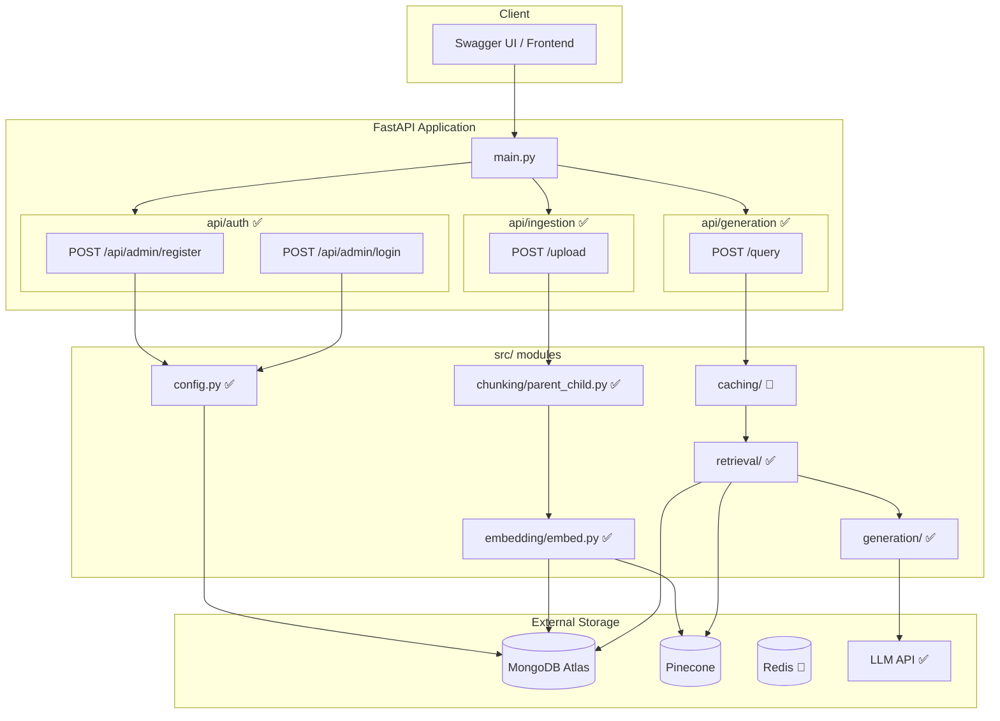

# devRAG — Retrieval-Augmented Generation System

A modular RAG system built with **FastAPI**, **MongoDB Atlas**, and **Pinecone** that supports user-authenticated document ingestion with parent-child chunking and automated version control.

## Architecture



## Features

| Feature | Status |
|---------|--------|
| User registration & login (MongoDB) | ✅ |
| JWT authentication (HTTPBearer) | ✅ |
| File upload (PDF, TXT) | ✅ |
| Parent-child document chunking | ✅ |
| **Document Versioning & Archiving** | ✅ |
| Pinecone vector upsert with metadata filtering | ✅ |
| Duplicate document detection (SHA256) | ✅ |
| Retrieval with optional reranking | ✅ |
| LLM-based answer generation (Groq) | ✅ |

## Tech Stack

- **API**: FastAPI + Uvicorn
- **Auth**: JWT (python-jose) + bcrypt
- **Database**: MongoDB Atlas (pymongo) — *Tracks users & document versions*
- **Vector Store**: Pinecone (llama-text-embed-v2) — *Tagged with version IDs*
- **Chunking**: LangChain RecursiveCharacterTextSplitter
- **Generation**: Groq (Llama 3.3 70B)

## Quick Start

1. **Clone & install**: `git clone <repo-url> && pip install -r requirements.txt`
2. **Configure environment**: Copy `.env.example` to `.env` and fill in `CONNECTION_STRING`, `PINECONE_API_KEY`, and `GROQ_API_KEY`.
3. **Run**: `uvicorn main:app --reload`
4. **Test**: Open `http://localhost:8000/docs`

### How to Test Document Versioning:
1. **Upload a file** (e.g., `resume.pdf`).
2. **Query it** to see the results.
3. **Modify the file** locally and **upload it again** with the same filename.
4. **Query again** — the system will automatically fetch results only from the *new* version, while the old version is preserved (but ignored) in the background.

## Project Structure

```
├── main.py                  # FastAPI app entrypoint
├── api/
│   ├── auth/                # Registration & login
│   ├── ingestion/           # Versioned document upload
│   └── generation/          # Query & Answer generation
├── src/
│   ├── config.py            # MongoDB & Pinecone setup
│   ├── chunking/            # Parent-child splitting logic
│   ├── embedding/           # Pinecone indexing
│   ├── retrieval/           # Filtered retrieval & reranking
│   └── generation/          # Groq LLM integration
└── docs/
    └── architecture.md      # Detailed diagrams & flowcharts
```