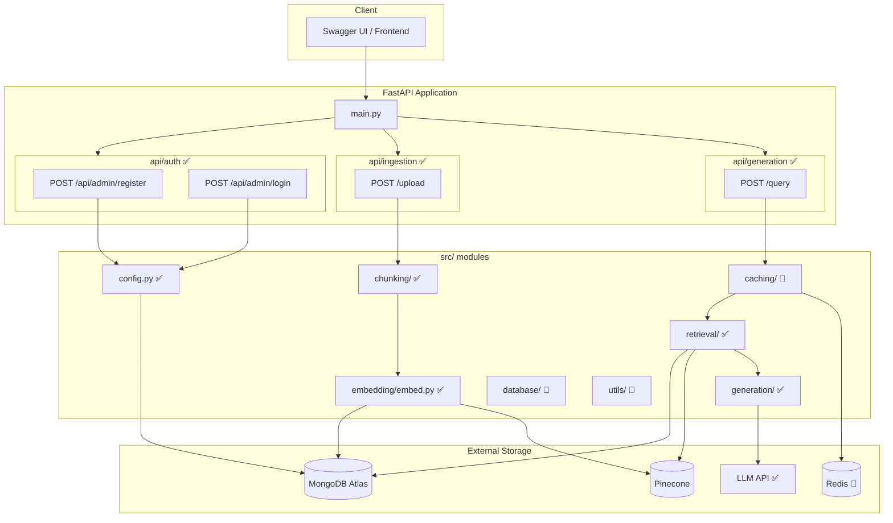
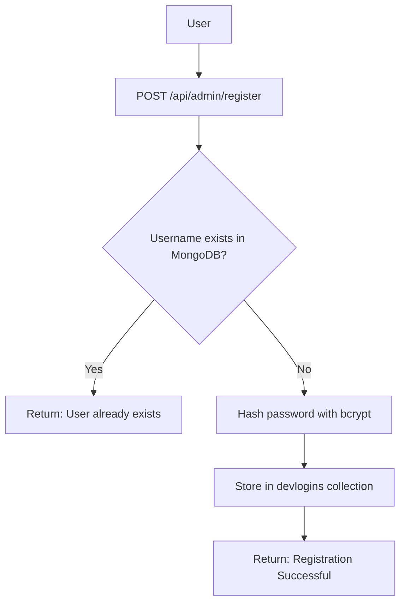
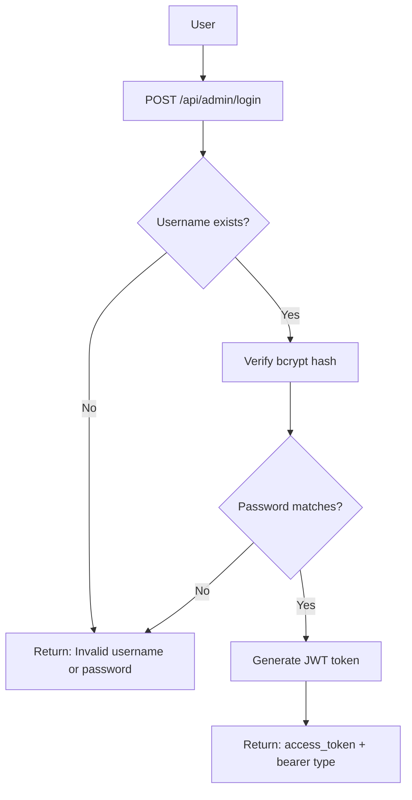
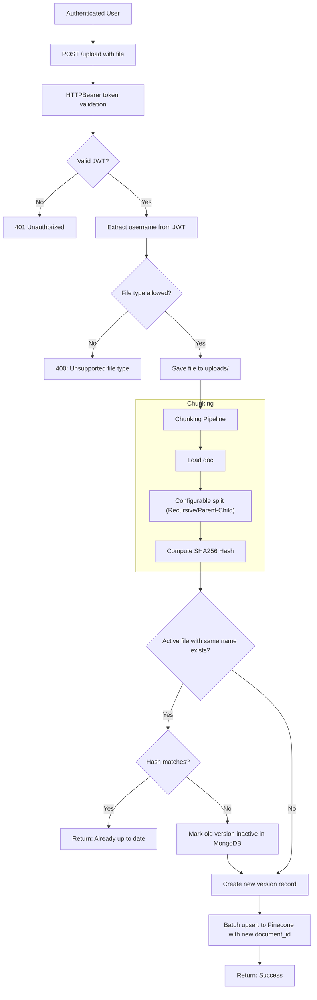

# Architecture Document

## Overview

This project implements a Retrieval-Augmented Generation (RAG) system with:

- ✅ User registration & login (MongoDB)
- ✅ JWT-based authentication (HTTPBearer)
- ✅ Namespace isolation in Pinecone (per-user)
- ✅ Configurable document chunking (Recursive Character & Parent-Child)
- ✅ Automated document versioning & archiving (MongoDB)
- 🔲 Multi-tier caching (Exact, Semantic, Retrieval)
- ✅ Retrieval with metadata filtering & optional reranking
- ✅ LLM-based answer generation

---

## System Architecture



---

# 1. User Registration ✅



**Implemented in:** `api/auth/route.py`, `api/auth/services.py`

---

# 2. User Login ✅



**Implemented in:** `api/auth/route.py`, `api/auth/services.py`
- Token expires in 24 hours
- Algorithm: HS256

---

# 3. Document Ingestion ✅



**Implemented in:** `api/ingestion/route.py`, `src/chunking/` (both strategies), `src/embedding/embed.py`

### Chunking Details
| Parameter | Default |
|-----------|---------|
| Strategy | parent_child (or recursive_character) |
| Parent chunk size | 1000 |
| Parent chunk overlap | 200 |
| Child chunk size | 200 |
| Child chunk overlap | 20 |

---

# 4. Query Pipeline ✅

```mermaid
flowchart TD
    A["User Query + Namespace"] --> B["Validate Request"]
    B --> C["Exact Cache - Tier 1"]
    C -->|Hit| D["Return Cached Answer"]
    C -->|Miss| E["Semantic Cache - Tier 2"]
    E -->|Hit| D

    E -->|Miss| F["Fetch Active Document IDs from MongoDB"]
    F --> G["Search Pinecone with metadata filter: document_id IN active_ids"]
    
    G --> H{"Rerank Enabled?"}
    H -- Yes --> I["Rerank results"]
    H -- No --> J["Build Context"]
    I --> J

    J --> K["Generate Answer via LLM"]
    K --> L["Store in Cache"]
    L --> D

    style C fill:#333,stroke:#888,stroke-dasharray: 5 5
    style E fill:#333,stroke:#888,stroke-dasharray: 5 5
    style L fill:#333,stroke:#888,stroke-dasharray: 5 5
```



---

# 5. Data Storage

```mermaid
erDiagram
    DEVLOGINS {
        ObjectId _id PK
        string username
        string hashed_password
    }

    DOCUMENT_COLLECTION {
        string document_id PK
        string filename
        string namespace
        string source_hash
        datetime uploaded_at
        boolean is_active
    }

    PINECONE_INDEX_METADATA {
        string _id PK
        string document_id FK
        string chunk_text
        string parent_id (optional)
        string source
        int page (optional)
        string source_hash_value
        vector embedding
    }

    DEVLOGINS ||--o{ DOCUMENT_COLLECTION : "namespace = username"
    DOCUMENT_COLLECTION ||--o{ PINECONE_INDEX_METADATA : "document_id (Metadata Filter)"
```

### Storage Responsibilities

| Store | Technology | Purpose |
|-------|-----------|--------|
| User credentials | MongoDB Atlas (`devlogins`) | Auth & Namespace mapping |
| Document tracking | MongoDB Atlas (`document_collection`) | Version control & active filters (Fetched during Retrieval Phase) |
| Vector chunks | Pinecone (`devrag` index) | Semantic search with MongoDB ID Filtering |
| Cached responses | Redis | Performance optimization |
| LLM generation | Groq API | RAG answer generation |

---

# 6. Module Status

| Module | Status |
|--------|--------|
| `api/auth/` | ✅ Implemented |
| `api/ingestion/` | ✅ Document versioning implemented |
| `src/config.py` | ✅ MongoDB, Pinecone, JWT config |
| `src/chunking/` | ✅ Configurable (Recursive/Parent-Child) |
| `src/embedding/` | ✅ Pinecone management |
| `src/retrieval/` | ✅ Filtering & Reranking implemented |
| `src/generation/` | ✅ Groq integration |
| `src/caching/` | 🔲 Planned |