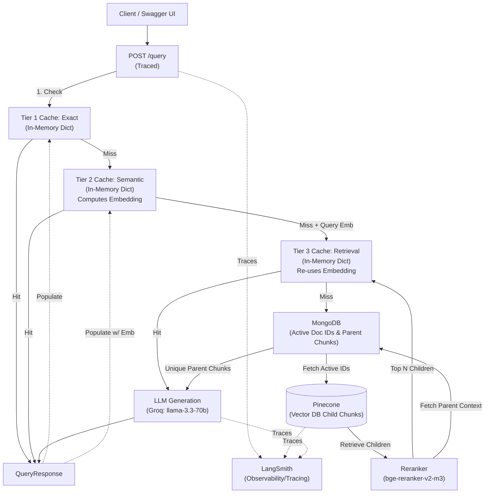

# TierRAG Architecture Document

## Overview

This project implements a Retrieval-Augmented Generation (RAG) system with:

- ✅ User registration & login (MongoDB)
- ✅ JWT-based authentication (HTTPBearer)
- ✅ Namespace isolation in Pinecone (per-user)
- ✅ Configurable document chunking (Recursive Character & Parent-Child)
- ✅ Automated document versioning & archiving (MongoDB)
- ✅ Multi-tier caching (Exact, Semantic, Retrieval) with in-memory dictionaries
- ✅ Retrieval with metadata filtering & optional reranking
- ✅ LLM-based answer generation
- ✅ End-to-end tracing and observability (LangSmith)

---

## System Architecture Diagram

This diagram outlines the complete query and retrieval flow, explicitly highlighting the cache tiers.

---

## Query Flow Walkthrough

Tracing a single query through the entire system:

1. **Request Initiation:** The user sends a query via POST `/query`. The system extracts the user's namespace from the JWT token.
2. **Tier 1 (Exact Cache) Check:**
   - The system checks if the exact query string (lowercased/stripped) exists in the Exact Cache.
   - *Hit Scenario:* Instantly returns the cached answer and sources.
   - *Miss Scenario:* Moves to Tier 2.
3. **Tier 2 (Semantic Cache) Check:**
   - The query is embedded using `all-MiniLM-L6-v2`. The system computes cosine similarity against cached queries in the Semantic Cache.
   - *Hit Scenario:* If similarity >= `0.92` (threshold), it returns the semantically equivalent cached answer and sources.
   - *Miss Scenario:* Moves to Tier 3.
4. **Tier 3 (Retrieval Cache) Check:**
   - The system calculates cosine similarity of the query against cached queries in the Retrieval Cache.
   - *Hit Scenario:* If similarity >= `0.85`, it instantly returns the previously retrieved document chunks, bypassing the vector database completely. It then jumps straight to Step 6 (Generation).
   - *Miss Scenario:* Moves to full retrieval (Step 5).
5. **Full Retrieval & Reranking:**
   - The system fetches active document IDs for the user's namespace from MongoDB Atlas.
   - Pinecone is queried with a metadata filter restricting results to active `document_id`s.
   - Retrieved chunks are optionally pushed through a cross-encoder reranker (e.g., bge-reranker-v2-m3) to boost relevance.
   - The final chunks populate the **Tier 3 (Retrieval) Cache** for future similar queries.
6. **Generation:**
   - The LLM (via Groq API) applies the retrieved chunks as context and generates an answer.
7. **Cache Population & Response:**
   - The final answer and sources are saved to both **Tier 1 (Exact)** and **Tier 2 (Semantic)** caches.
   - The `QueryResponse` is fully returned to the user, denoting which cache tier (if any) fulfilled the request.

---

## Chunking Strategy Explanation

The system supports two configurable chunking strategies, set via `CHUNKING_STRATEGY` in the configuration.

### 1. Parent-Child Chunking
- **How it works:** Documents are first split into larger "parent" chunks and then sub-divided into smaller "child" chunks. The full "parent" chunks are stored in MongoDB (`parent_store`). Only the child chunks are vectorized and embedded into Pinecone, but they carry a `parent_id` in their metadata.
- **Parameters:**
  - `PARENT_CHUNK_SIZE` = 1000, `PARENT_CHUNK_OVERLAP` = 200
  - `CHILD_CHUNK_SIZE` = 200, `CHILD_CHUNK_OVERLAP` = 20
- **Metadata Linking:** Each parent gets a unique `parent_id` (e.g., `hash-parent-1`). Children retain this `parent_id` in their metadata. During inference, if child chunks are retrieved, their unique `parent_id`s are used to query MongoDB for the broader parent context, which is then supplied to the LLM instead of the individual small child chunks.

### 2. Recursive Character Chunking (Baseline)
- **How it works:** A single-pass approach that splits text into uniform sizes with a sliding overlap window using Langchain's `RecursiveCharacterTextSplitter`.
- **Parameters:**
  - `CHUNK_SIZE` = 512
  - `CHUNK_OVERLAP` = 100
- **Why it was chosen:** It serves as a strong, simple baseline strategy that works well for generalized text and straightforward queries without the overhead of tracking relationships.

### Comparison & Usage
- Use **Recursive Character** for general-purpose retrieval where facts are localized and the answer fits nicely into a ~500 token window.
- Use **Parent-Child** when queries require broader context to answer. It allows the system to retrieve highly specific matching vectors (small child chunks) but supplies the LLM with the larger encompassing section (the parent chunk), significantly improving LLM comprehension.

---

## Caching Architecture

The multi-tier caching system intercepts redundant queries to minimize latency, API, and compute costs. A key optimization is that **the query embedding is computed strictly once** during the Semantic Cache tier evaluation, and the same NumPy array is passed down through the rest of the verification pipeline to avoid parallel or duplicate invocations to `sentence-transformers`.

### Tier Implementation details
1. **Tier 1: Exact Cache** (`src/caching/exact_cache.py`)
   - **Data stored:** Query string (key) mapped to `(answer, sources)` tuple.
   - **Mechanism:** O(1) dictionary lookup on exact match.
2. **Tier 2: Semantic Cache** (`src/caching/semantic_cache.py`)
   - **Data stored:** Query string, `all-MiniLM-L6-v2` embedding array, answer string, and sources list.
   - **Mechanism:** Computes the query embedding once. Iterates over cached items, computes cosine similarity, and hits if `sim >= SEMANTIC_CACHE_THRESHOLD` (0.92). If it misses, it returns the generated query embedding array.
3. **Tier 3: Retrieval Cache** (`src/caching/retrieval_cache.py`)
   - **Data stored:** Query string, `all-MiniLM-L6-v2` embedding array, and **retrieved chunks list**.
   - **Mechanism:** Takes in the previously computed query embedding. Iterates over cached items, computes cosine similarity, and returns context chunks if `sim >= RETRIEVAL_CACHE_THRESHOLD` (0.85). Prevents redundant Vector DB queries.

### Cache Invalidation & Parameters
- **Invalidation Strategy (Manual / Ephemeral):** Currently, there is **no automated cache invalidation** (no TTL or LRU). The cache simply grows indefinitely in memory. Invalidation requires manually restarting the application.
- **Configurable Parameters (`src/config.py`):**
  - `SEMANTIC_CACHE_THRESHOLD`: 0.92
  - `RETRIEVAL_CACHE_THRESHOLD`: 0.85

---

## Design Decisions & Trade-offs

### Caching Backend: In-Memory Dictionary vs. Redis
The caching backend was purposefully implemented using primitive Python in-memory dictionaries instead of a dedicated cache like Redis. 
- **Reasoning:** Setting up and learning Redis for the first time was proving difficult under project time constraints. To ensure the architecture functioned logically without getting blocked by learning time constraints, in-memory dictionaries were chosen as an immediate, practical solution to solidify the core logic of the system.
- **Trade-off:** While extremely fast, the dictionaries are volatile (wiped entirely on server restart), do not scale and lack built-in memory management. 